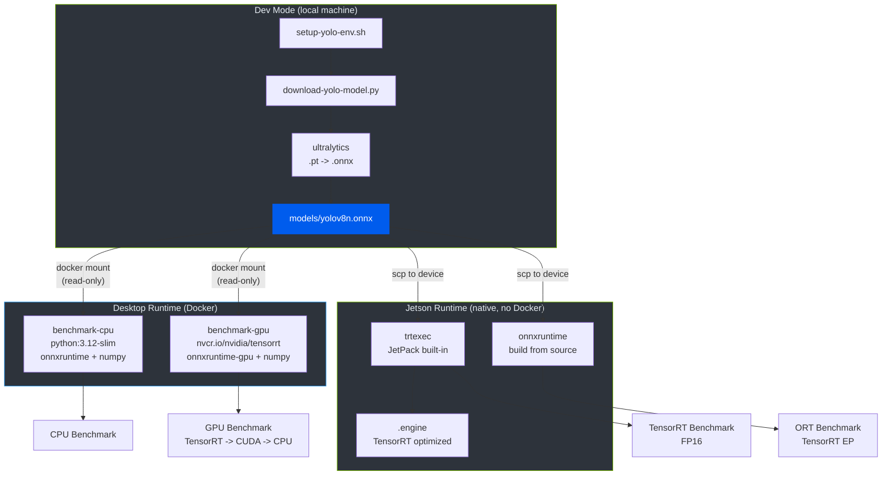
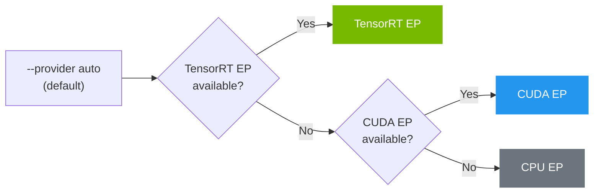
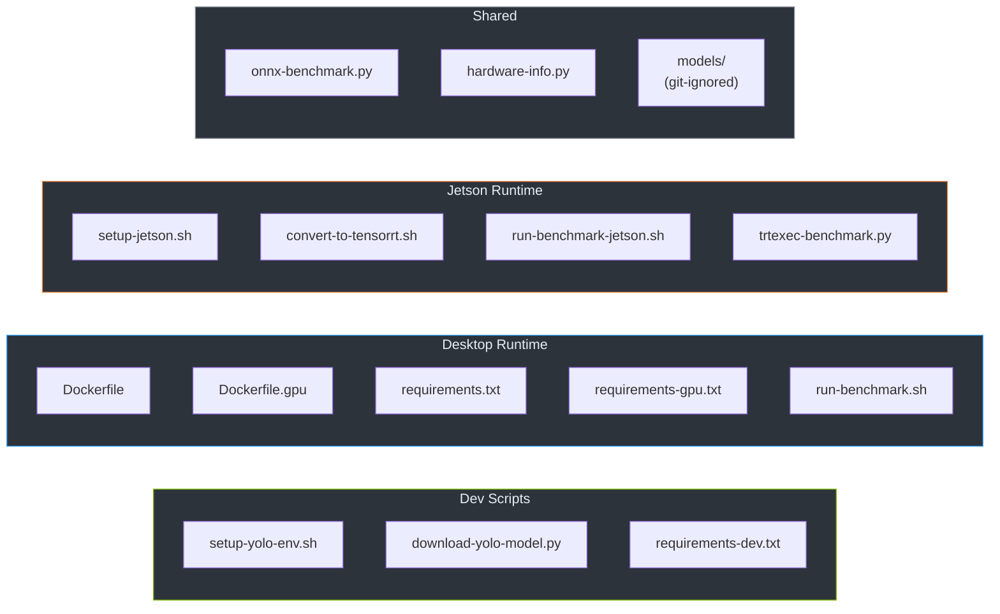

# Board Benchmark

Benchmark YOLO model inference across execution providers (TensorRT, CUDA, CPU) on desktop GPUs and NVIDIA Jetson edge devices.

## How It Works

The project separates model preparation from inference benchmarking:

- **Dev mode** (local machine) -- downloads YOLO `.pt` weights, exports to `.onnx`
- **Desktop runtime** (Docker) -- benchmarks `.onnx` with `onnxruntime` in minimal containers
- **Jetson runtime** (native) -- benchmarks on-device with `trtexec` and optional `onnxruntime`, no Docker



## Quick Start

### 1. Export model (dev machine)

```bash
bash benchmarkCLI/setup-yolo-env.sh
source benchmarkCLI/.venv/bin/activate

# YOLOv8 nano (default, ~12 MB ONNX)
python3 benchmarkCLI/download-yolo-model.py --model yolov8n

# YOLOv8 medium (~100 MB ONNX)
python3 benchmarkCLI/download-yolo-model.py --model yolov8m

# Any variant: yolov8n/s/m/l/x, yolo11n/s/m/l/x
python3 benchmarkCLI/download-yolo-model.py --model yolov8s --half
```

### 2a. Benchmark on desktop (Docker)

```bash
# Default model (yolov8n)
bash benchmarkCLI/run-benchmark.sh

# Specify model
bash benchmarkCLI/run-benchmark.sh --model yolov8m

# GPU only with custom iterations
bash benchmarkCLI/run-benchmark.sh --model yolov8m --gpu-only -n 500

# CPU only
bash benchmarkCLI/run-benchmark.sh --model yolov8m --cpu-only

# Skip rebuild on repeated runs
bash benchmarkCLI/run-benchmark.sh --model yolov8m --skip-build -n 1000
```

### 2b. Benchmark on Jetson TX2 NX (native, no Docker)

```bash
# Copy model to Jetson
scp benchmarkCLI/models/yolov8m.onnx jetson:benchmarkCLI/models/

# On Jetson: validate environment
bash benchmarkCLI/setup-jetson.sh

# trtexec with FP32/FP16/INT8 comparison
bash benchmarkCLI/run-benchmark-jetson.sh --model yolov8m --trtexec-only -p fp32 fp16 int8 -n 100

# TRT Python API (needs pycuda)
bash benchmarkCLI/run-benchmark-jetson.sh --model yolov8m --trt-python -p fp16 int8 -n 100

# Default (auto-detect method, yolov8n)
bash benchmarkCLI/run-benchmark-jetson.sh
```

`run-benchmark.sh` auto-detects Jetson and redirects to the native runner.

## Example Output

### GPU vs CPU comparison

```
========================================================
  BENCHMARK SUMMARY
========================================================
  Model: yolov8n | Iters: 100 | Batch: 1

  Metric             GPU (TensorRT)          CPU
  ------------------ -------------- ------------
  Avg latency            0.812 ms    24.344 ms
  Min latency            0.701 ms    20.749 ms
  Median                 0.787 ms    24.347 ms
  P95                    1.002 ms    27.857 ms
  P99                    1.105 ms     28.73 ms
  FPS                      1231.5        41.07  29.98x

  Speedup: 29.98x (latency) | 29.98x (FPS)
```

## CLI Options

### run-benchmark.sh (desktop)

| Option | Default | Description |
|--------|---------|-------------|
| `--gpu-only` | off | GPU benchmark only |
| `--cpu-only` | off | CPU benchmark only |
| `--model NAME` | `yolov8n` | YOLO model name |
| `-n NUM` | `100` | Benchmark iterations |
| `-w NUM` | `10` | Warmup iterations |
| `-b NUM` | `1` | Batch size |
| `--skip-build` | off | Reuse cached Docker images |
| `--build-only` | off | Build images only |

### run-benchmark-jetson.sh

| Option | Default | Description |
|--------|---------|-------------|
| `--trtexec-only` | off | trtexec CLI benchmark |
| `--trt-python` | off | TRT Python API benchmark (needs pycuda) |
| `--ort-only` | off | onnxruntime benchmark |
| `--all` | off | Run all available methods |
| `-p PREC [PREC...]` | `fp16` | Precision(s): `fp32`, `fp16`, `int8` |
| `--model NAME` | `yolov8n` | YOLO model name (yolov8n/s/m/l/x) |
| `-n NUM` | `100` | Benchmark iterations |
| `-w NUM` | `10` | Warmup iterations |
| `-b NUM` | `1` | Batch size |

### download-yolo-model.py

| Option | Default | Description |
|--------|---------|-------------|
| `--model` / `-m` | `yolov8n` | Model (yolov8n/s/m/l/x, yolo11n/s/m/l/x) |
| `--imgsz` / `-s` | `640` | Input image size |
| `--opset` | `17` | ONNX opset version |
| `--output-dir` / `-o` | `models` | Output directory |
| `--half` | off | FP16 export |

## Docker Images

| Image | Base | Size | Use |
|-------|------|------|-----|
| `benchmark-cpu` | `python:3.12-slim` | ~150 MB | CPU-only benchmark |
| `benchmark-gpu` | `nvcr.io/nvidia/tensorrt:24.07-py3` | ~8 GB | TensorRT + CUDA benchmark |

GPU image requires [NVIDIA Container Toolkit](https://docs.nvidia.com/datacenter/cloud-native/container-toolkit/latest/install-guide.html).

## Execution Provider Fallback



| `--provider` | EP chain |
|--------------|----------|
| `auto` (default) | TensorRT -> CUDA -> CPU |
| `tensorrt` | TensorRT -> CUDA -> CPU |
| `cuda` | CUDA -> CPU |
| `cpu` | CPU only |

Unavailable providers are silently skipped. Active EP is reported in output.

## Jetson Notes

- **Supported**: Jetson TX2 NX with JetPack 4.6.x (CUDA 10.2, TensorRT 8.2.1)
- **No Docker**: 4 GB shared RAM makes container overhead significant
- **Two backends**: `trtexec` (always available) and `onnxruntime` (build from source)
- **`.engine` files are device-specific** -- not portable across TensorRT versions
- **onnxruntime**: no pre-built aarch64 wheel; see `setup-jetson.sh` for build instructions

## File Structure



## Output Metrics

| Metric | Description |
|--------|-------------|
| Avg / Min / Max latency | Inference time per iteration (ms) |
| Median / P95 / P99 | Latency percentiles (ms) |
| Std deviation | Latency consistency (ms) |
| FPS | Frames per second |
| Throughput | Samples per second |

## Prerequisites

| Target | Requirements |
|--------|-------------|
| Dev | Python 3.10+, internet |
| Desktop | Docker, NVIDIA Container Toolkit (GPU) |
| Jetson | JetPack 4.6.x, ONNX model from dev machine |

## License

This project is licensed under the [MIT License](LICENSE).
